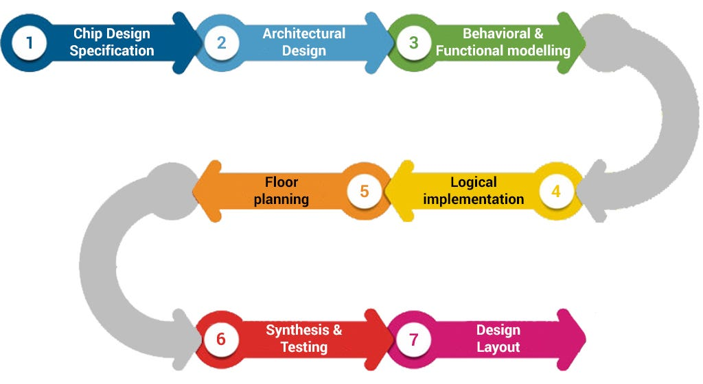
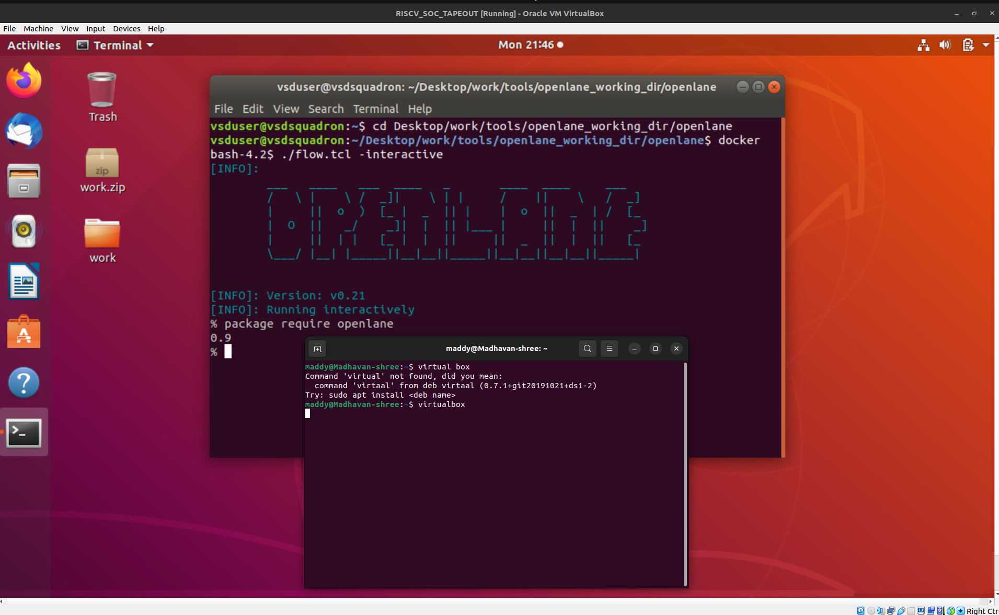
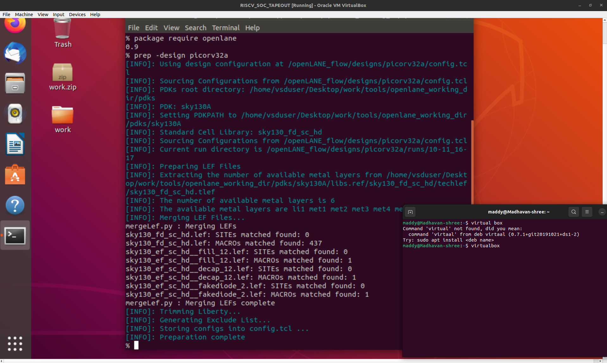
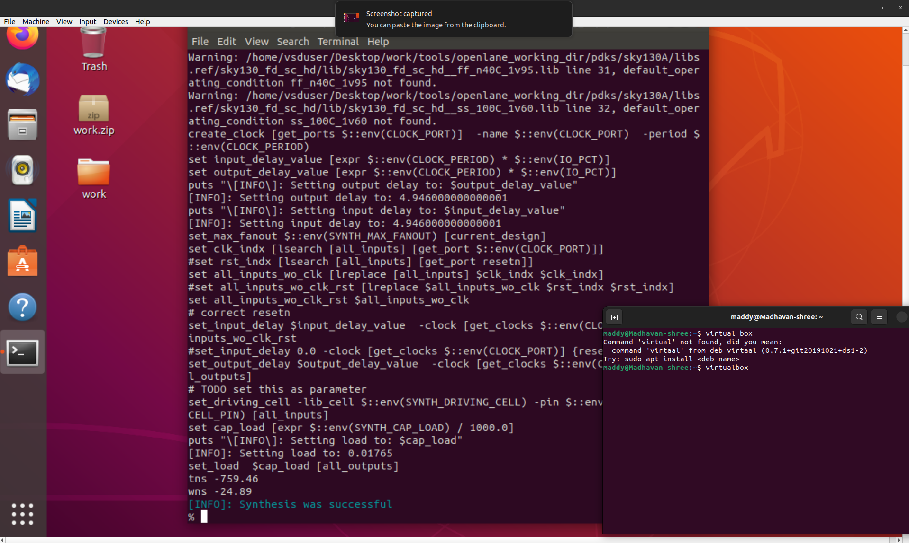
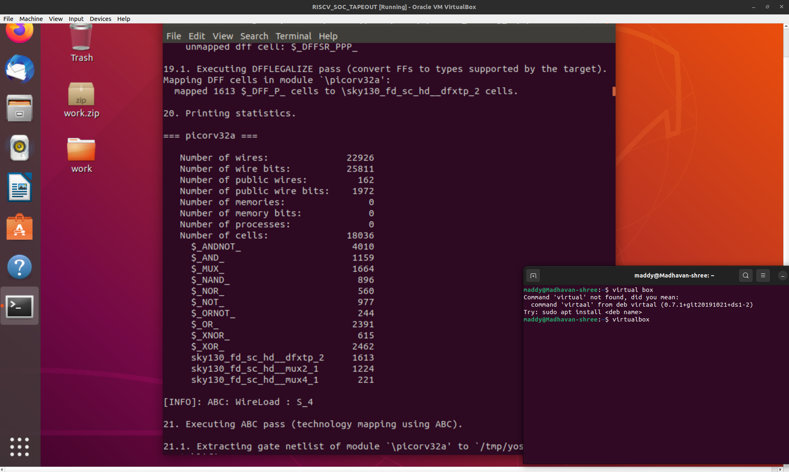
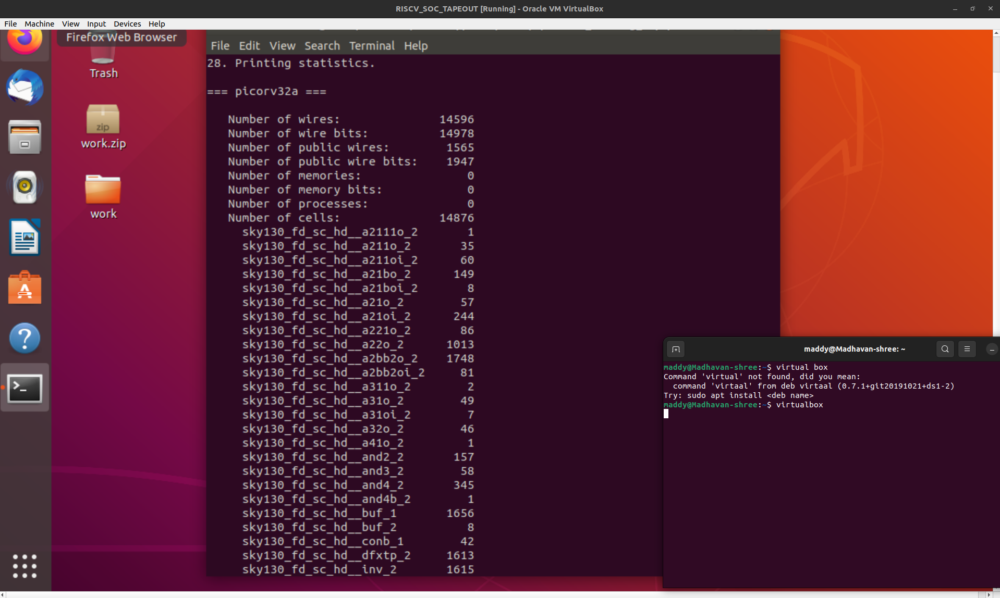

# ⚡ Week 6 – Day 1

## **Foundations of Open-Source EDA, OpenLANE Flow, and Sky130 PDK**

---

### 🧩 **RISC-V SoC Tapeout Program – Physical Design Track**

---

## 🧠 **Theoretical Understanding**

The first day of Week 6 marks the transition from digital design to **physical implementation** — where our Verilog descriptions begin their transformation into silicon layouts.

This session focused on exploring the **open-source physical design ecosystem**, the **OpenLANE RTL-to-GDSII flow**, and the **SkyWater 130 nm Process Design Kit (PDK)**, which together form the base for open silicon prototyping.

---

### 🔍 **1. Overview of the ASIC Design Flow**

An **Application-Specific Integrated Circuit (ASIC)** is a chip built for a dedicated purpose.

The process that converts RTL (Register Transfer Level) code into a **fabrication-ready GDSII layout** is known as the **RTL-to-GDSII flow**.

| **Stage** | **Purpose** |
| --- | --- |
| RTL Design | Hardware behavior written in Verilog |
| Synthesis | Translates RTL into logic gates using a standard cell library |
| Floorplanning | Defines chip area, aspect ratio, and power grid structure |
| Placement | Physically arranges logic cells on the chip area |
| CTS | Builds the clock distribution network |
| Routing | Connects all logic cells with metal interconnects |
| Sign-off | Checks for design rule violations and timing issues |
| GDSII Export | Generates layout data for fabrication |

---

### 🧩 **2. Open-Source EDA Toolchain**

The shift from commercial to open-source tools has made VLSI design accessible to students and researchers worldwide.

Below are the key tools involved in each stage of the flow:

| **Design Stage** | **Tool** |
| --- | --- |
| Logic Synthesis | **Yosys** |
| Technology Mapping | **ABC** |
| Static Timing Analysis | **OpenSTA** |
| Floorplanning, Placement, Routing | **OpenROAD / TritonRoute** |
| Clock Tree Synthesis | **TritonCTS** |
| DRC/LVS Checks | **Magic**, **Netgen** |
| Layout Visualization | **KLayout** |

All these tools integrate seamlessly under one automated environment — **OpenLANE**.

---

### ⚙️ **3. The OpenLANE Flow**

<p align="center"></p>

**OpenLANE** is a fully automated open-source RTL-to-GDSII flow built on top of the **SkyWater Sky130 PDK**.

It streamlines each design stage through Tcl-based scripting and runs inside a Docker container for environment consistency.

**Main Highlights:**

- Complete RTL → GDSII automation
- Step-wise modular execution (`run_synthesis`, `run_floorplan`, etc.)
- Built-in timing, power, and physical verification
- Supports multiple standard-cell libraries (`sky130_fd_sc_hd`, `hs`, `ll`)

The diagram below shows how RTL data passes through various stages to generate a layout:

> (Insert diagram: RTL → Synthesis → Floorplan → Placement → CTS → Routing → GDSII)
> 

---

### 🧮 **4. SkyWater 130 nm PDK**

The **Sky130 PDK**, jointly released by **Google** and **SkyWater Technology Foundry**, is the world’s first **fully open-source process design kit**.

It includes:

- Design rule and layout verification parameters
- Device models (NMOS, PMOS)
- Standard cell libraries (HD, HS, LL variants)
- Layer definitions and process information

This PDK serves as the connection between **EDA tools** and **physical chip manufacturing**.

---

### 🔧 **5. Understanding Synthesis**

The synthesis stage is the first crucial step in physical design.

Here, **Yosys** converts Verilog RTL into a **gate-level netlist** using standard cells from the PDK.

It provides:

- **Cell count** – total number of logic elements used
- **Area estimation** – predicted silicon area before layout
- **Flip-flop ratio** – ratio of sequential to combinational logic

These parameters offer insight into circuit complexity and guide later physical optimization.

---

## 🧭 **Practical Implementation**

### 🔹 Step 1: Launching OpenLANE and Setting Up the Environment

To begin, I entered the OpenLANE directory and invoked the interactive Docker environment.

```bash
cd ~/work/tools/openlane_working_dir/openlane
docker
./flow.tcl -interactive
package require openlane 0.9
```

<p align="center"></p>

---

### 🔹 Step 2: Design Preparation

I prepared the reference SoC design `picorv32a`, which automatically generates configuration files and working directories.

```bash
prep -design picorv32
```

The above command initializes a new run directory inside `designs/picorv32a/runs/`, where all flow reports (synthesis, placement, etc.) are stored.

<p align="center"></p>

---

### 🔹 Step 3: Running Logic Synthesis

The synthesis stage was executed using **Yosys**, which translates RTL code into a technology-mapped netlist.

```bash
run_synthesis
```

<p align="center"></p>

<p align="center"></p>

After synthesis, I examined the generated report:

```bash
less runs/30-10_08-35/reports/synthesis/1-yosys_4.stat.rpt
```

This file summarizes the total number of logic cells, flip-flops, and overall logic area.

<p align="center"></p>

---

### 🔹 Step 4: Report Interpretation

From the synthesis report, we can calculate the **flip-flop ratio** as:

Flop Ratio=Number of DFFsTotal Cells=161314876=0.1084 (10.84%)Flop\ Ratio = \frac{Number\ of\ DFFs}{Total\ Cells} = \frac{1613}{14876} = 0.1084 \ (10.84\%)

Flop Ratio=Total CellsNumber of DFFs=148761613=0.1084 (10.84%)

This ratio helps estimate sequential logic density.

<p align="center"></p>

---

### 🔹 Step 5: Frequently Used Commands

| **Command** | **Description** |
| --- | --- |
| `docker` | Launches OpenLANE container |
| `./flow.tcl -interactive` | Starts interactive OpenLANE mode |
| `package require openlane 0.9` | Loads OpenLANE package |
| `prep -design picorv32a` | Prepares design environment |
| `run_synthesis` | Executes logic synthesis |
| `less runs/.../1-yosys_4.stat.rpt` | Views synthesis report |

---

### 🧠 **Summary – Day 1 Highlights**

| **Topic** | **Key Learning** |
| --- | --- |
| **RTL-to-GDSII Flow** | The full process of converting RTL to a silicon-ready layout |
| **OpenLANE Framework** | Open-source, automated design flow integrating multiple EDA tools |
| **Sky130 PDK** | Open-source process library providing device models and DRC/LVS rules |
| **Synthesis Phase** | First physical design step that produces gate-level netlist |
| **Yosys Reports** | Contain metrics like area, cell count, and logic ratios for analysis |

---

### 🔗 **Next Step**

➡️ Continue with **[Day 2: Floorplanning and Library Cells](https://github.com/madhavanshree2006/RISC-V-SoC-Tapeout_Week-6/tree/main/DAY2)**,

where you’ll study **core vs die areas**, **aspect ratio**, **utilization factors**, and perform **floorplan + placement** runs using OpenLANE, followed by visualization in **Magic**.

---
