# ⚙️ Week 6 — Day 2

## 🧩 Good Floorplan vs Bad Floorplan & Introduction to Library Cells

**Objective:**

The second day of Week 6 dives into one of the most essential parts of ASIC physical design — **floorplanning** and **placement**, followed by a conceptual look at how **standard cells are designed and characterized**.

This session builds upon the synthesized netlist generated earlier and introduces how the chip area, pins, and cell positions are decided within the silicon die.

---

## 🧱 1. Chip Floorplanning

### 🔹 What is Floorplanning?

Floorplanning is the stage where logical blocks, standard cells, and I/O pins are arranged inside the chip’s core area.

A well-designed floorplan ensures:

- Proper connectivity among modules and pins
- Efficient utilization of silicon area
- Minimal routing congestion and timing issues
- A balanced power network across the die
    
<p align="center">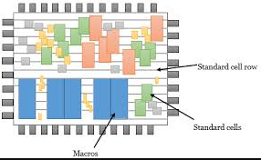</p>
    

---

### ⚙️ Key Parameters

### ➤ Utilization Factor

The ratio between the area occupied by standard cells and the total core area:

Utilization Factor=Area of Standard CellsTotal Core AreaUtilization\ Factor = \frac{Area\ of\ Standard\ Cells}{Total\ Core\ Area}

Utilization Factor=Total Core AreaArea of Standard Cells

For good design practices, it’s kept between **0.5–0.7 (50–70%)**, allowing enough whitespace for routing and future optimizations.

### ➤ Aspect Ratio

Defined as:

Aspect Ratio=HeightWidthAspect\ Ratio = \frac{Height}{Width}

Aspect Ratio=WidthHeight

A near-square aspect ratio (**≈ 1**) helps in maintaining uniform routing density and balanced performance across the chip.

---

## ⚡ 2. Power Planning

Power planning defines how **VDD** and **VSS** lines are distributed across the die.

Its goal is to reduce **IR drop** and **ground bounce** by ensuring a steady supply of power to every region of the chip.

- **IR Drop:** Voltage reduction due to metal line resistance.
- **Ground Bounce:** Voltage fluctuation in ground due to switching current.

A strong power grid ensures consistent performance and minimizes noise effects.

<p align="center">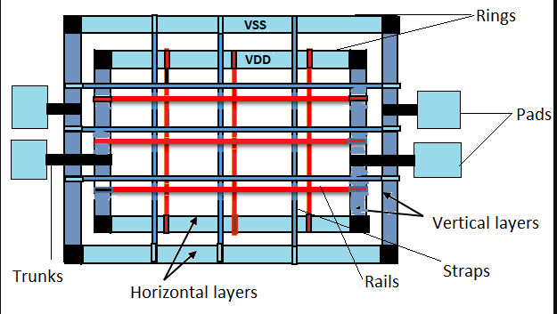</p>

---

## 📍 3. Pin Placement

Pin placement is critical for timing and congestion optimization.

The positioning of pins affects how long interconnections will be and how many buffers are needed.

Common methods include:

- **Equidistant Pin Placement:** Pins spaced evenly on the boundary.
- **Clustered Pin Placement:** Pins grouped based on module connectivity.

<p align="center">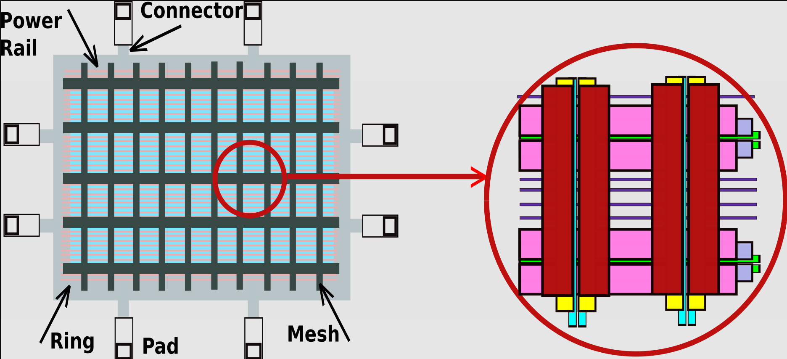</p>

---

## 🧰 4. Running Floorplan in OpenLANE

Once synthesis is complete, floorplanning can be executed using OpenLANE’s interactive shell:

AS usually follow the day1 steps to open the docker frome openlane folder and proceed from the synthesis part of day1 task 

<p align="center">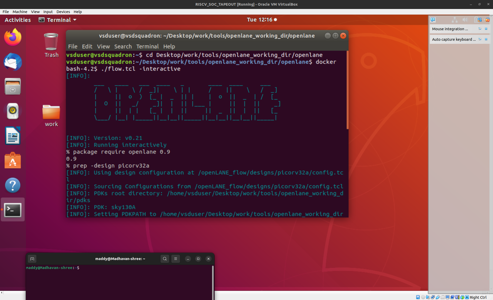</p>

1st move to the openlane folder and follow the below cmds :

```bash
cd Desktop/work/tools/openlane_working_dir/openlane/
```

```bash
docker

%./flow.tcl -interactive

%package require openlane 0.9

%prep -design picorv32a

%run_synthesis

%run_floorplan

```

<p align="center">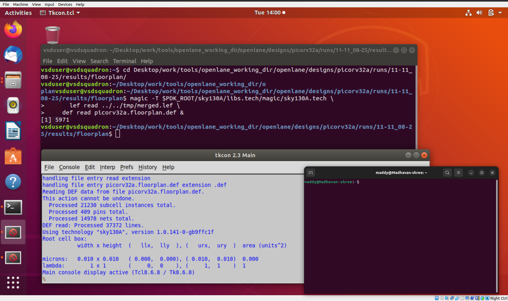</p>

This generates a **DEF file (`.def`)**, which defines the die size, core area, pin positions, and power grid structure.

---

### 📊 Floorplan Output Example

```
[INFO]: Running Floorplan...
[STEP 1]: Reading config.tcl
[STEP 2]: Creating Core Area
[STEP 3]: Inserting Tapcells & Decaps
[STEP 4]: Generating pin placement
[INFO]: Floorplan completed successfully.

```

<p align="center">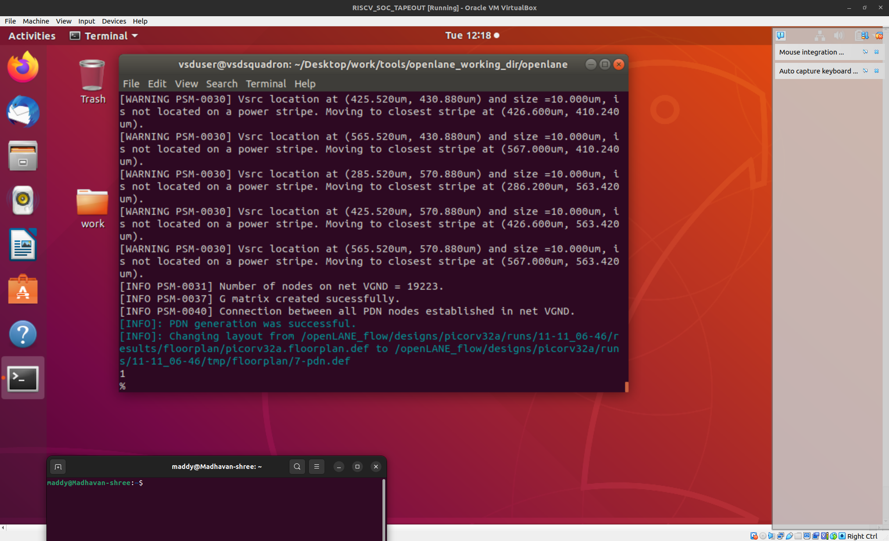</p>

---

## ➡️ 5. **📏 Die Area Calculation  in microns**

From `picorv32a.floorplan.def` :

```
DIEAREA ( 0 0 ) ( 660685 671405 )
1000 unit distance = 1 micron
```

**Die Width** = 660685 / 1000 = 660.685 μm

**Die Height** = 671405 / 1000 = 671.405 μm

**Area** = 660.685 × 671.405 = 443,587.21 μm²

<p align="center">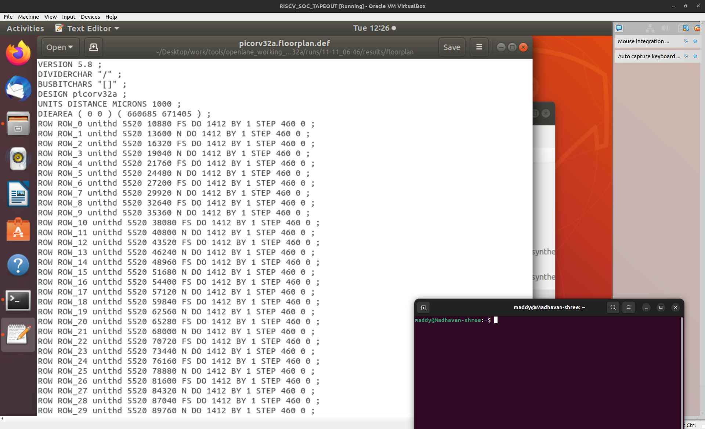</p>

---

## 🧮 6. Viewing Floorplan in Magic

After running the floorplan, visualize the result using **Magic Layout Tool**.

Make sure the following files are present:

1. `sky130A.tech` — Technology file
2. `merged.lef` — Library Exchange Format
3. `picorv32a.floorplan.def` — Floorplan output

Command:

move to the repected folder accordingly, but in this cmd 

‼️ cd Desktop/work/tools/openlane_working_dir/openlane/designs/picorv32a/runs/ (change according to yours) 👉 10-11_16-17 👈 /results/floorplan/ ‼️

```bash
cd Desktop/work/tools/openlane_working_dir/openlane/designs/picorv32a/runs/11-11_08-25/results/floorplan/
```

Then follow the cmd below :

```bash
magic -T $PDK_ROOT/sky130A/libs.tech/magic/sky130A.tech \
      lef read ../../tmp/merged.lef \
      def read picorv32a.floorplan.def &
```

<p align="center">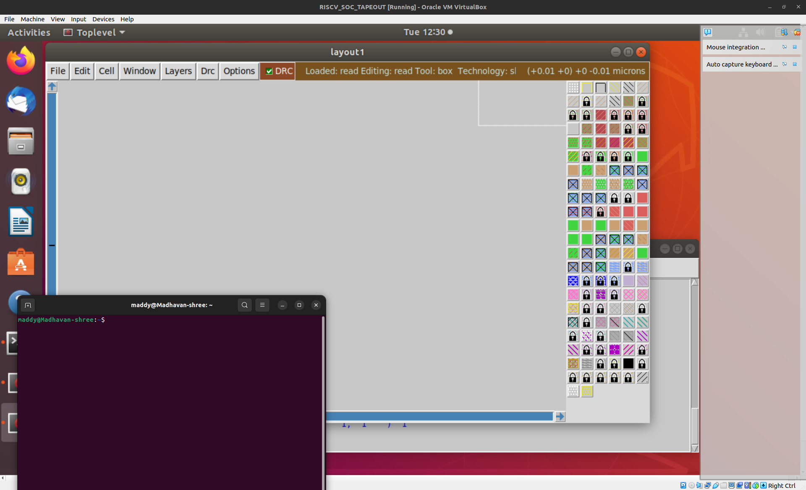</p>

<p align="center">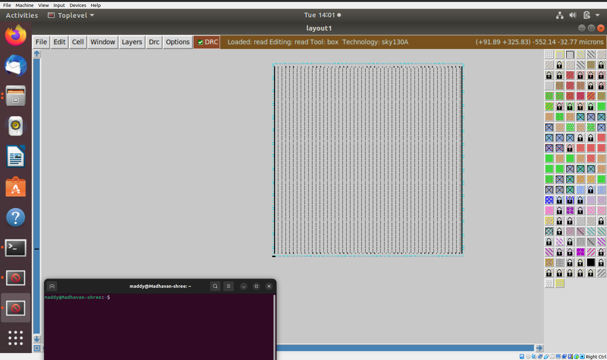</p>

You can now observe:

- Core boundaries
- Pin locations
- Tap and decap cell placements
    
<p align="center">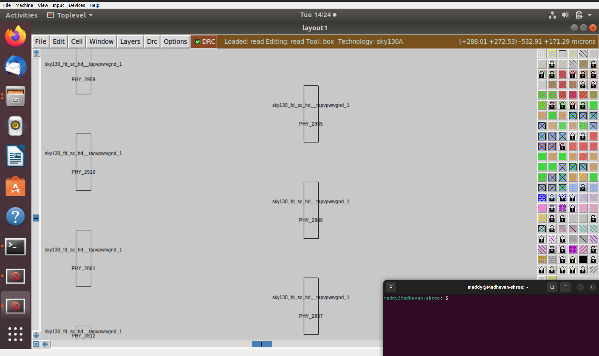</p>
    
    

---

## 🧩 7. Placement Stage

### 🔸 What is Placement?

Placement determines **where each standard cell will physically sit** on the chip.

This step tries to minimize total wire length, meet timing constraints, and balance cell density.

It happens in **two phases**:

1. **Global Placement** — Initial coarse positioning
2. **Detailed Placement** — Fine-tuning and legalization (removes overlaps)

---

### 🔧 Placement in OpenLANE

```bash
run_placement
```

<p align="center">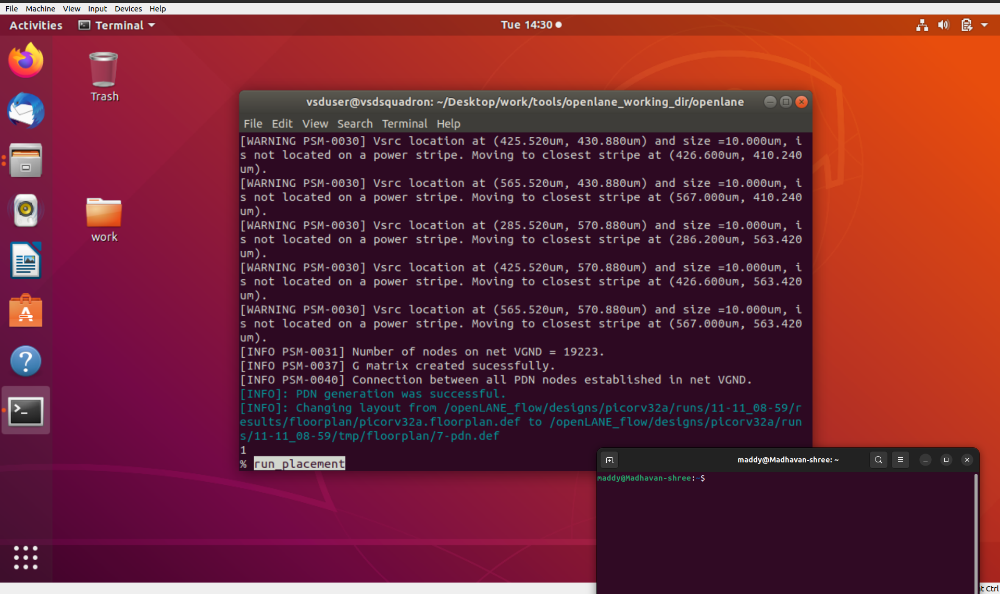</p>

<p align="center">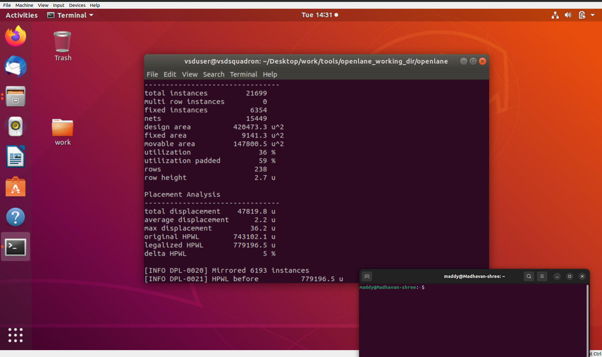</p>

<p align="center">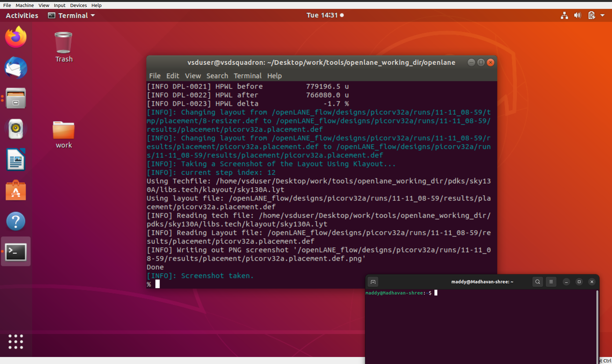</p>

OpenLANE automatically optimizes cell positions and creates the **`picorv32a.placement.def`** file.

This file contains the coordinates of every placed cell and the finalized layout view.

<p align="center">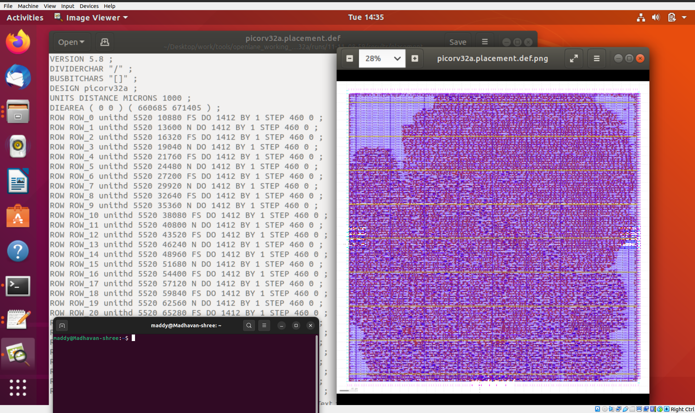</p>

---

### 🔍 Viewing Placement in Magic

‼️ cd Desktop/work/tools/openlane_working_dir/openlane/designs/picorv32a/runs/ (change according to yours) 👉 10-11_16-17 👈 /results/floorplan/ ‼️

```bash
cd Desktop/work/tools/openlane_working_dir/openlane/designs/picorv32a/runs/11-11_08-25/results/floorplan/
```

To check placement visually:

```bash

magic -T $PDK_ROOT/sky130A/libs.tech/magic/sky130A.tech \
      lef read ../../tmp/merged.lef \
      def read picorv32a.placement.def &
```

<p align="center">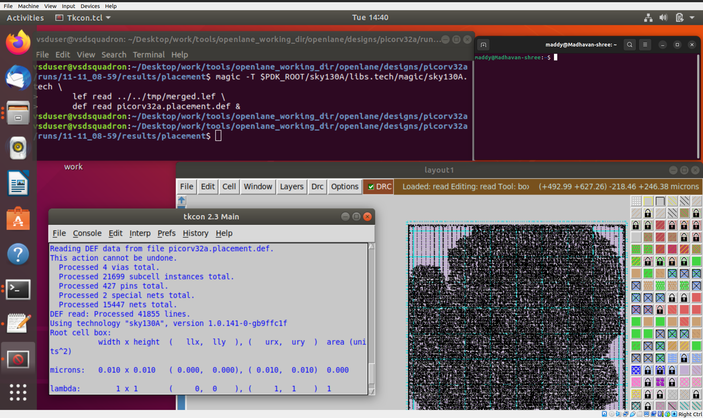</p>

You can zoom in to verify the **standard-cell rows** and **cell orientations**.

Global and detailed placement steps can be verified through the Magic viewer.

<p align="center">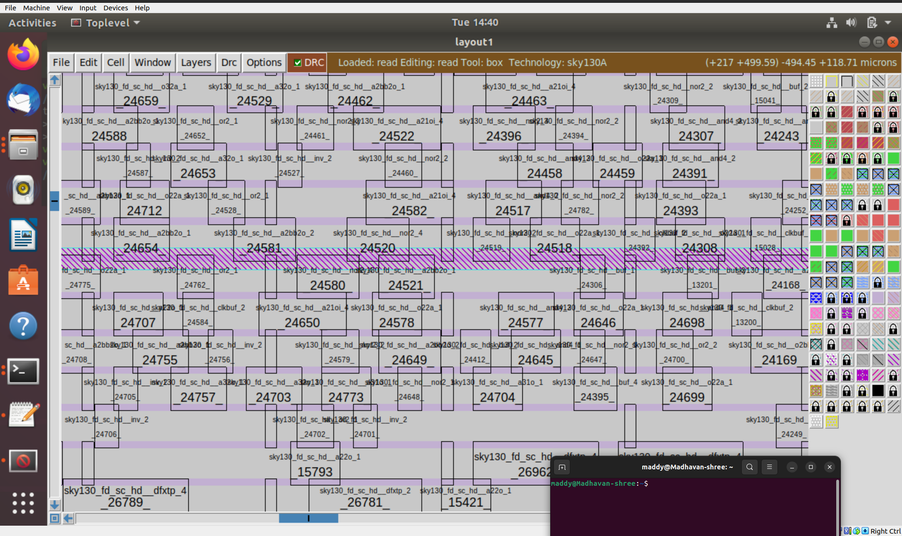</p>

---

## 🧠 8. Standard Cell Design & Characterization Flow

### 🧩 a) Cell Design Flow

Each standard cell (like inverter, NAND, etc.) goes through a series of steps before it’s added to the library:

1. **Specification & Logic Design**
2. **Schematic Creation & Simulation**
3. **Layout Design (Physical view)**
4. **DRC & LVS Verification**
5. **Characterization (timing, power, function)**
6. **Library Generation (.lib, .lef, .gds)**

These verified cells become part of the standard cell library used in synthesis and placement.

---

### 🧩 b) Cell Characterization Flow

Characterization defines **how the cell behaves electrically** by extracting timing, power, and constraint data using SPICE simulations.

Steps:

1. Netlist Extraction
2. Parameter Specification
3. Model Selection
4. SPICE Simulation & Measurement
5. Model Generation
6. Verification & Validation

These models are stored in `.lib` format and help STA tools estimate delay and power accurately during synthesis.

---

## ✅ 9. Summary Table

| Step | Task | Tool / Command | Output File / Result |
| --- | --- | --- | --- |
| 1 | Run floorplan | `run_floorplan` | `picorv32a.floorplan.def` |
| 2 | Visualize layout | Magic | Floorplan view |
| 3 | Run placement | `run_placement` | `picorv32a.placement.def` |
| 4 | Visualize placement | Magic | Standard-cell arrangement |
| 5 | Study cell flow | Conceptual | Cell design & characterization diagrams |

---

## 🔗 Next Step

➡️ Proceed to **Day 3 — Custom Library Cell Design using Magic & ngspice**

You’ll create your own **CMOS inverter**, perform **DRC/LVS checks**, extract a **SPICE netlist**, and measure its **delay and power characteristics**.
