### 🛠️ Day 3 — Custom Library Cell Design using Magic & NGSPICE

**📚 RISC-V SoC Reference Program — Week 6**

Welcome to **Day 3** of the Week 6 journey!

In this session, you’ll dive into creating a **CMOS inverter** layout from scratch using **Magic**, and perform its **circuit-level simulation** in **NGSPICE**.

This exercise lays the groundwork for developing your own reusable, technology-compliant standard cells that can be part of a complete ASIC library.

---

### 🧠 1. Overview — Standard Cell Design Flow

Every standard cell (inverter, NAND, NOR, etc.) passes through a complete **design–verification–validation** cycle before being added to a PDK library.

| Stage | Task | Tool | Output |
| --- | --- | --- | --- |
| 1 | Layout Design | Magic | `.mag` layout file |
| 2 | DRC Verification | Magic | DRC-clean layout |
| 3 | Netlist Extraction | Magic | `.ext` / `.spice` files |
| 4 | Circuit Simulation | NGSPICE | Transient plots |
| 5 | Final Validation | Magic | Verified layout |

---

### 🧰 2. Repository Setup & Tech Configuration

Before designing, prepare the working environment and Sky130 tech files.

```bash
# Navigate to OpenLANE working directory
cd Desktop/work/tools/openlane_working_dir/openlane

# Clone inverter cell repository
git clone https://github.com/nickson-jose/vsdstdcelldesign
cd vsdstdcelldesign

# Copy Sky130 technology file
cp /home/vsduser/Desktop/work/tools/openlane_working_dir/pdks/sky130A/libs.tech/magic/sky130A.tech .

# Verify contents
ls -la

```

<p align="center">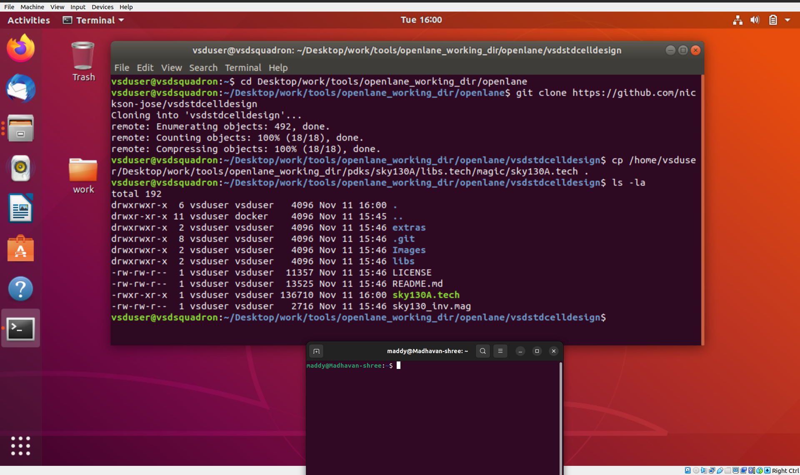</p>

---

### 🧩 3. Load Layout in Magic

Open the CMOS inverter layout in **Magic** to explore the device layers and geometries.

```bash
magic -T sky130A.tech sky130_inv.mag &

```

<p align="center">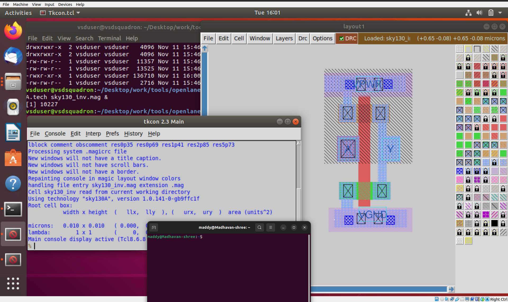</p>

---

### 🚧 4. Running Design Rule Check (DRC)

Magic provides built-in DRC features that verify the design against Sky130A technology constraints.

```bash
tech load sky130A.tech
drc check
drc why
```

Example output:

```
Transistor width < 0.42um (diff/tap.2)
```

<p align="center">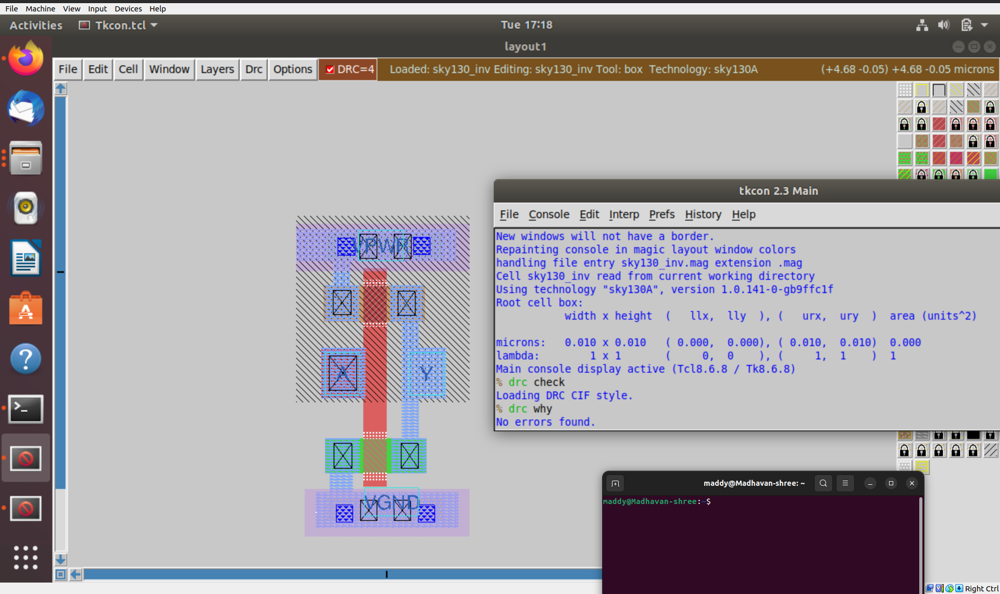</p>

---

### 📜 5. Extracting the SPICE Netlist

Once the layout is DRC-clean, the next step is to generate its SPICE netlist for circuit-level verification.

```bash
extract all

ext2spice cthresh 0 rthresh 0

ext2spice

box
```

<p align="center">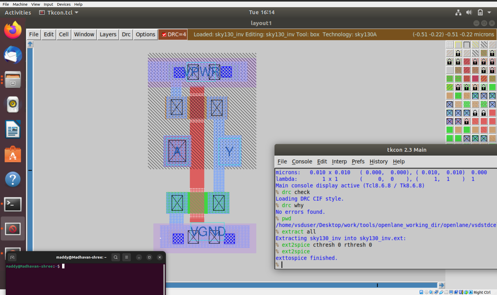</p>

<p align="center">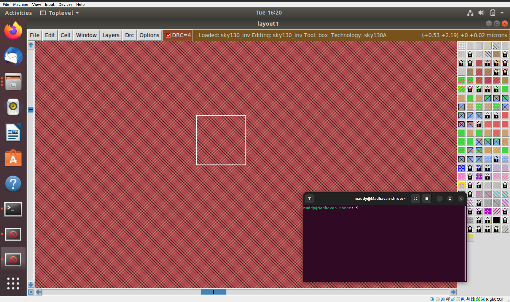</p>

This process creates a file named **sky130_inv.spice** containing all device and parasitic details.

<p align="center">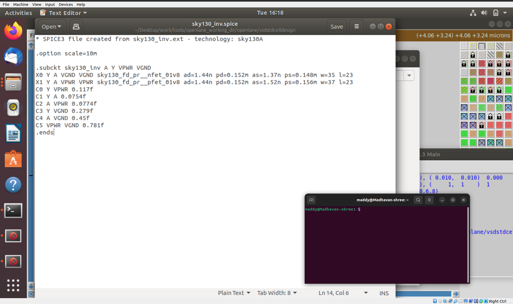</p>

---

### 🧾 6. Editing SPICE for Transient Simulation

Modify the generated netlist to include **input sources**, **power rails**, and **transient analysis commands**.

```
* SPICE3 netlist for sky130_inv.ext - tech: sky130A

.option scale=0.01u
.include libs/pshort.lib
.include libs/nshort.lib

M1000 Y A VPWR VPWR pshort_model.0 w=37 l=23
M1001 Y A VGND VGND nshort_model.0 w=35 l=23

VDD VPWR 0 3.3V
VSS VGND 0 0V
Va A VGND PULSE(0 3.3 0 0.1ns 0.1ns 2ns 4ns)

.tran 1n 20n
.control
run
.endc
.end

```

<p align="center">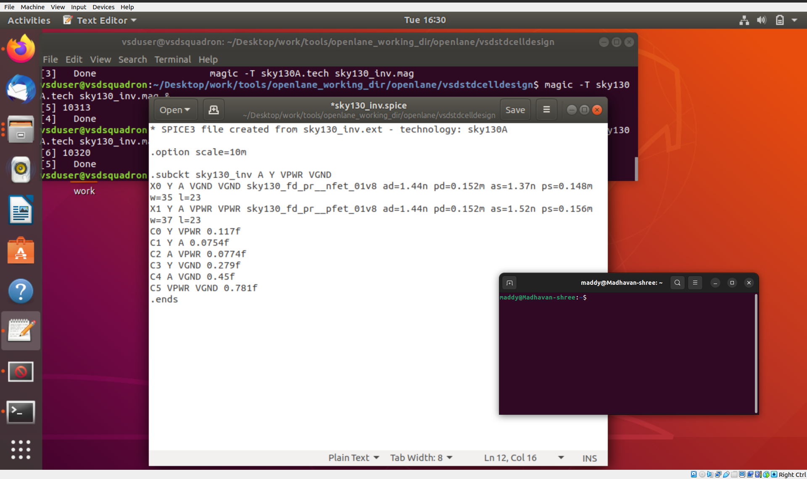</p>

<br>

<p align="center">⬇️</p>
<br>

<p align="center">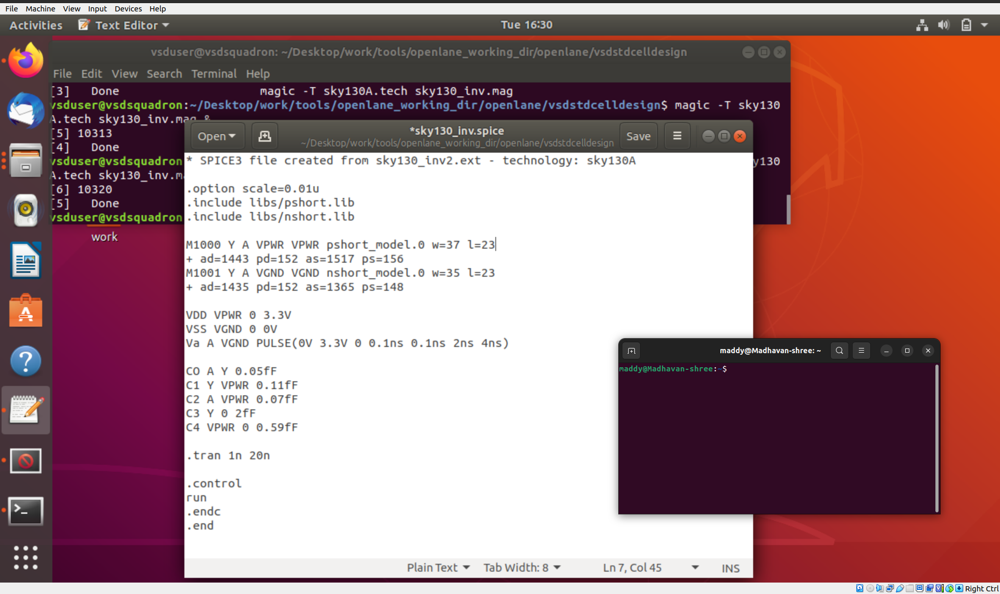</p>

---

### ⚡ 7. Simulating in NGSPICE

Run the transient analysis and visualize the inverter’s switching waveform.

```bash
ngspice sky130_inv.spice

```

<p align="center">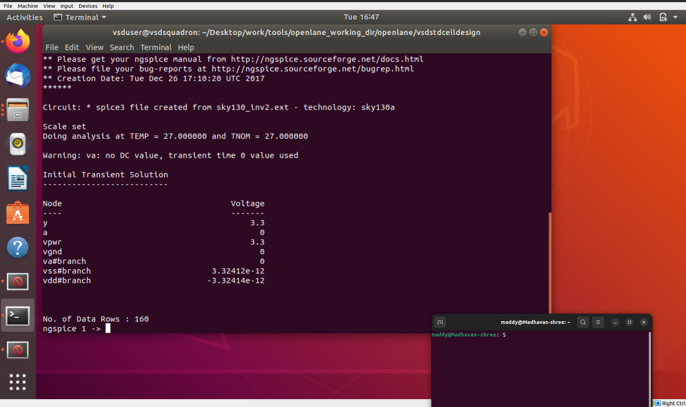</p>

Inside the simulator:

```bash
plot Y vs time A

```

<p align="center">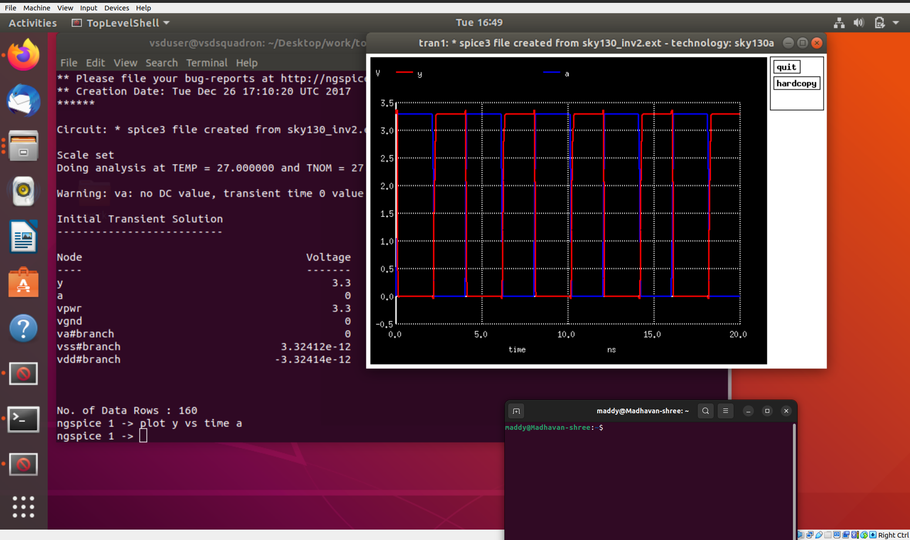</p>

Full view of the plot:

<p align="center">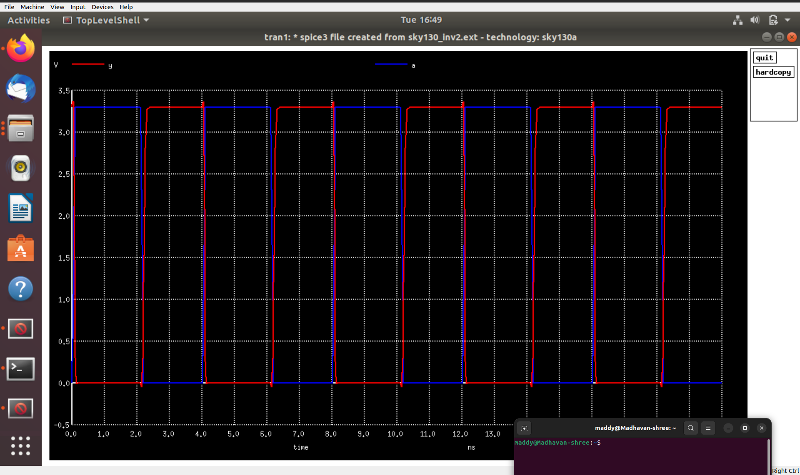</p>

The plotted waveform displays **input (A)** and **output (Y)** signals, from which you can calculate:

- Rise Time (tᵣ)
- Fall Time (t_f)
- Propagation Delay (t_pHL / t_pLH)

<p align="center">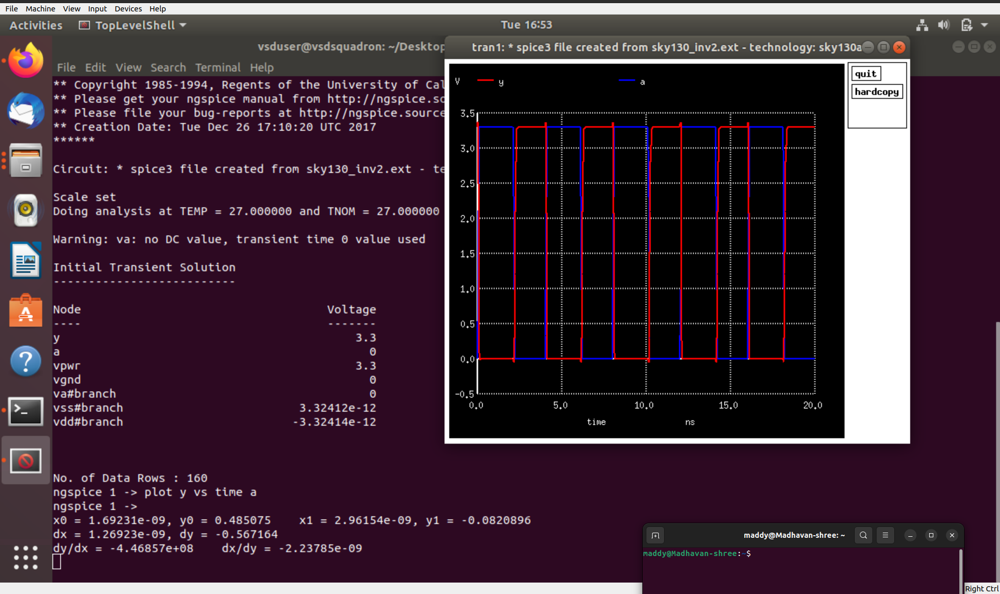</p>

---

### ✅ 8. Re-Validation — DRC Clean Confirmation

Once all corrections are made, verify that the layout is now error-free.

```bash
tech load sky130A.tech
drc check
drc why

```

Output:

<p align="center">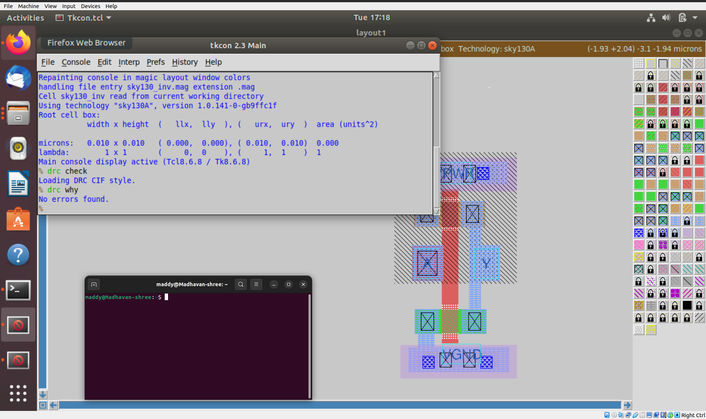</p>

```
No errors found.

```

---

### 🧮 9. Complete Flow Recap

| Step | Description | Tool | Result |
| --- | --- | --- | --- |
| 1 | Setup repo and tech file | Shell | Ready workspace |
| 2 | Load layout | Magic | Inverter viewed |
| 3 | DRC check | Magic | Initial fixes done |
| 4 | Extract SPICE | Magic | sky130_inv.spice |
| 5 | Add sources & simulation | Editor | Testbench ready |
| 6 | Run transient sim | NGSPICE | Waveforms plotted |
| 7 | DRC recheck | Magic | Layout finalized |

---

### 💡 10. Key Concepts Learned

| Concept | Description |
| --- | --- |
| Magic Layout | Open-source VLSI layout tool with PDK-based design and DRC engine |
| DRC Verification | Ensures layout follows fabrication design limits |
| SPICE Extraction | Converts layout data into transistor-level netlist |
| NGSPICE | Performs transient and DC simulations |
| Delay Measurement | Helps estimate circuit performance and propagation delay |

---

### 🔚 11. Summary

By completing this session, you successfully:

- Designed and visualized a CMOS inverter layout
- Extracted and modified its SPICE netlist
- Simulated and analyzed transient behavior
- Ensured the design was **DRC-clean** and ready for cell library integration

---

### ⏭️ Next Up

➡ **[Day 4 — Pre-Layout Timing Analysis and Clock Tree Role](https://github.com/madhavanshree2006/RISC-V-SoC-Tapeout_Week-6/tree/main/DAY4)**

Next, you’ll learn how to convert cells into **LEF format**, perform **Static Timing Analysis (STA)**, and understand the **Clock Tree Synthesis (CTS)** process.

---
