### 🧩 Step 1 — Validate DRC and Check Layout Compatibility

Before integrating the cell into the design flow, confirm these:

- ✅ **Input/Output Ports:** Must align with the intersection of vertical and horizontal routing tracks.
- ✅ **Width:** Should be an **odd multiple** of the horizontal track pitch.
- ✅ **Height:** Should be an **even multiple** of the vertical track pitch.

To open the custom inverter in **Magic**:

```bash
cd Desktop/work/tools/openlane_working_dir/openlane/vsdstdcelldesign
magic -T sky130A.tech sky130_inv.mag &

```

<p align="center">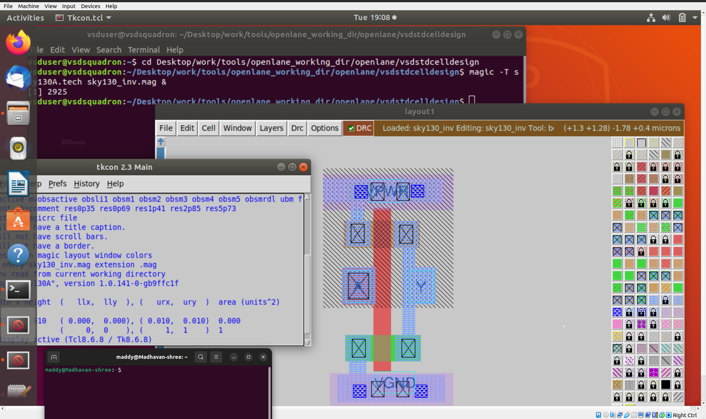</p>

<p align="center">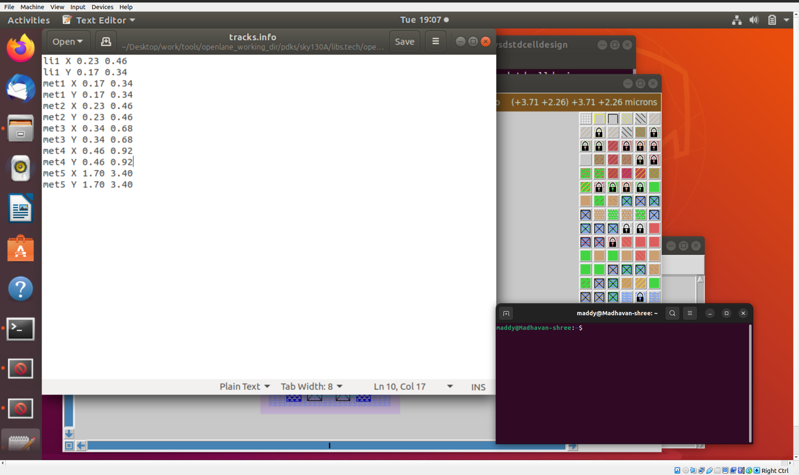</p>

Set grid alignment in **tkcon**:

```
grid 0.46um 0.34um 0.23um 0.17um
```

<p align="center">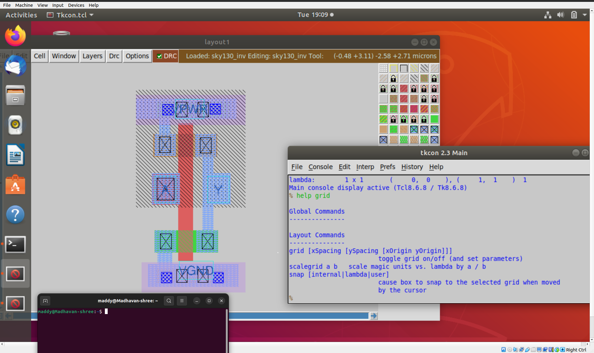</p>

All three cell dimension checks are verified successfully ✅

---

### 💾 Step 2 — Save Layout Under a New Name

```
save sky130_vsdinv.mag
magic -T sky130A.tech sky130_vsdinv.mag &

```

The new layout `sky130_vsdinv.mag` is successfully saved and reloaded.

---

### 🧱 Step 3 — Generate the LEF File

Use the **lef write** command in tkcon:

```
lef write

```

This creates the `sky130_vsdinv.lef` file required for integration.

<p align="center">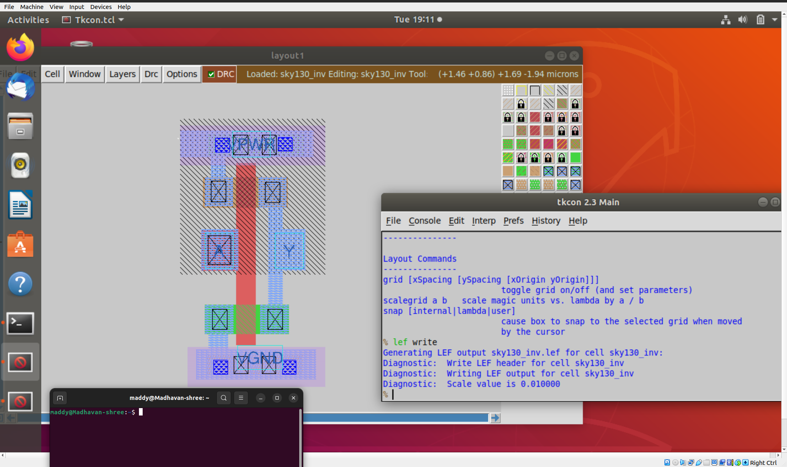</p>

<p align="center">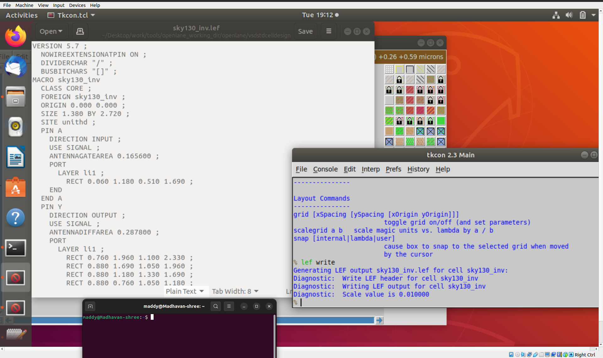</p>

### 📦 Step 4 — Transfer Required Files

---

Move the **LEF** and all relevant **LIB** files to the `picorv32a/src` directory:

```bash
cp sky130_vsdinv.lef ~/Desktop/work/tools/openlane_working_dir/openlane/designs/picorv32a/src/
cp libs/sky130_fd_sc_hd__* ~/Desktop/work/tools/openlane_working_dir/openlane/designs/picorv32a/src/

```

<p align="center"></p>

---

### ⚙️ Step 5 — Update `config.tcl`

```bash
cd ~/Desktop/work/tools/openlane_working_dir/openlane/designs/picorv32a

# open the config.tcl file 
```

Add the following to integrate your custom library and LEF file:

```
set ::env(LIB_SYNTH) "$::env(OPENLANE_ROOT)/designs/picorv32a/src/sky130_fd_sc_hd__typical.lib"
set ::env(LIB_FASTEST) "$::env(OPENLANE_ROOT)/designs/picorv32a/src/sky130_fd_sc_hd__fast.lib"
set ::env(LIB_SLOWEST) "$::env(OPENLANE_ROOT)/designs/picorv32a/src/sky130_fd_sc_hd__slow.lib"
set ::env(LIB_TYPICAL) "$::env(OPENLANE_ROOT)/designs/picorv32a/src/sky130_fd_sc_hd__typical.lib"
set ::env(EXTRA_LEFS) [glob $::env(OPENLANE_ROOT)/designs/$::env(DESIGN_NAME)/src/*.lef]

```

<p align="center">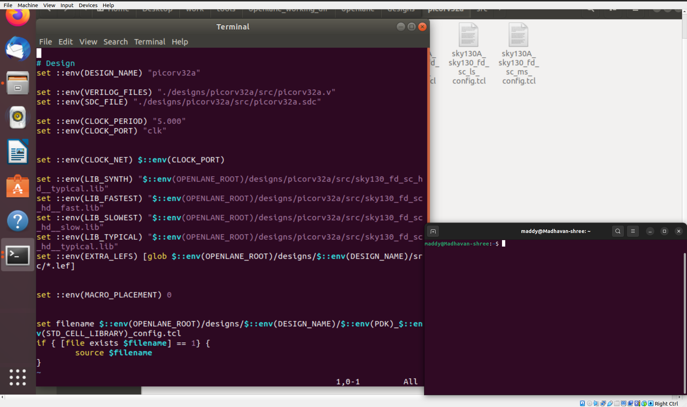</p>

---

### 🧮 Step 6 — Run Synthesis with Custom Inverter

Launch the OpenLANE Docker environment and synthesize:

```bash
cd Desktop/work/tools/openlane_working_dir/openlane
docker

```

<p align="center">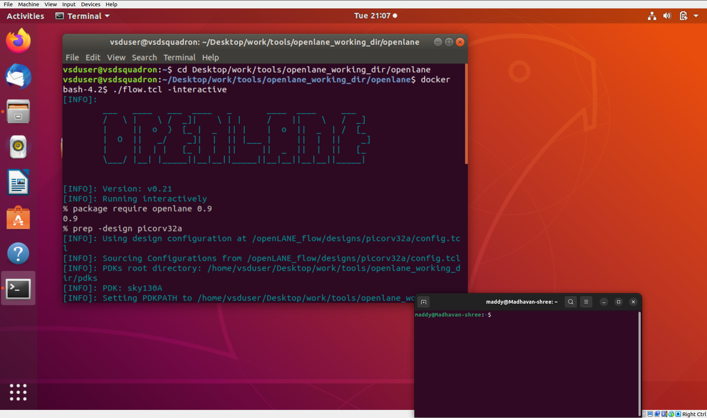</p>

Inside the Docker shell:

```
./flow.tcl -interactive
package require openlane 0.9
prep -design picorv32a
set lefs [glob $::env(DESIGN_DIR)/src/*.lef]
add_lefs -src $lefs
run_synthesis

```

<p align="center">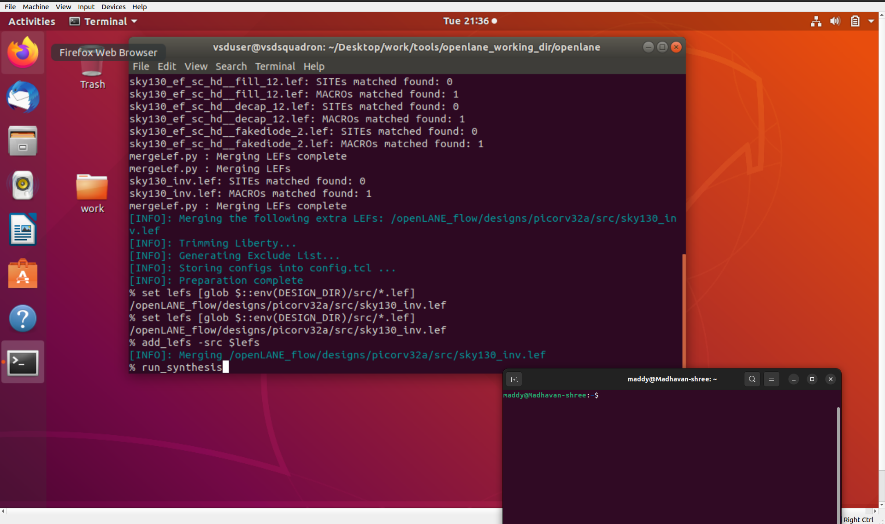</p>

<p align="center">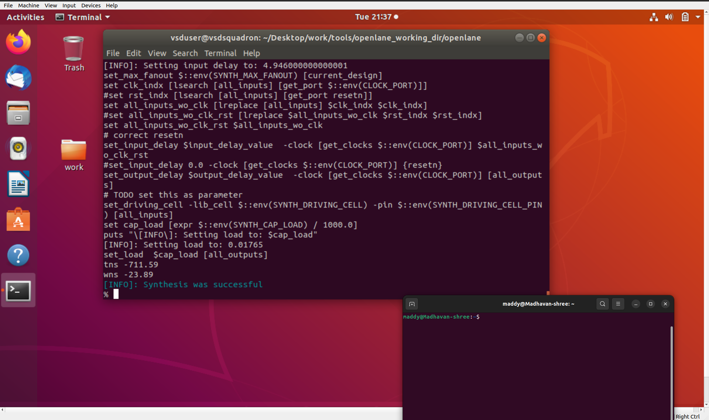</p>

---

### 🧩 Step 7 — Optimize Violations via Parameter Tuning

Modify parameters to improve timing:

```
prep -design picorv32a -tag 24-03_10-03 -overwrite
set ::env(SYNTH_STRATEGY) "DELAY 3"
set ::env(SYNTH_SIZING) 1
run_synthesis

```

<p align="center">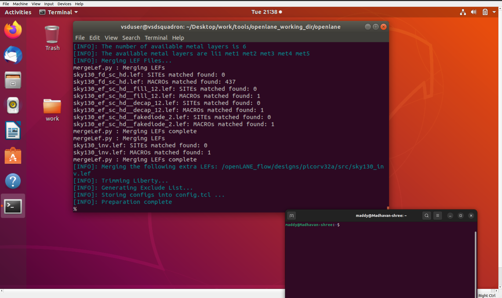</p>

<p align="center">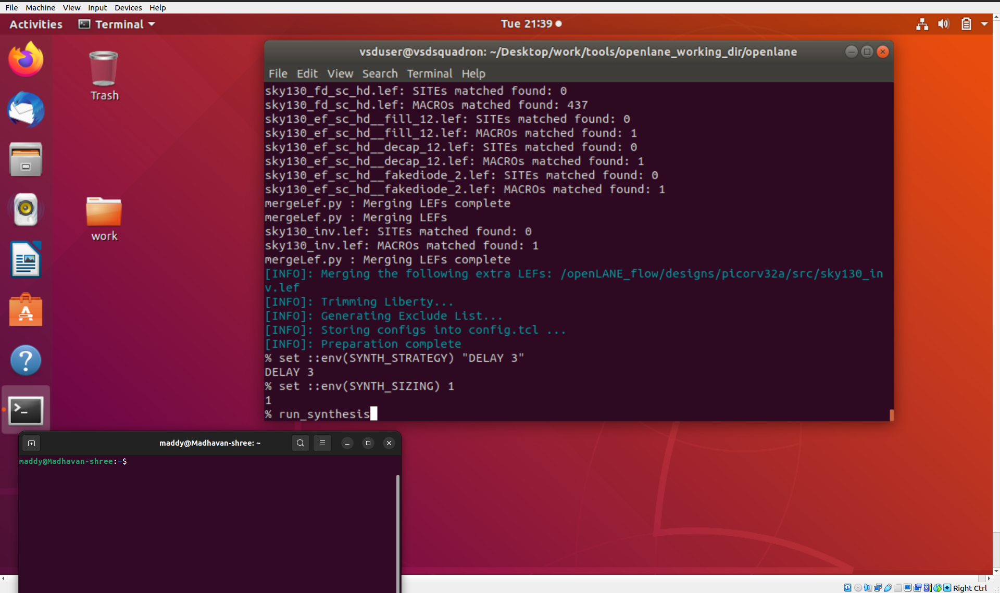</p>

<p align="center">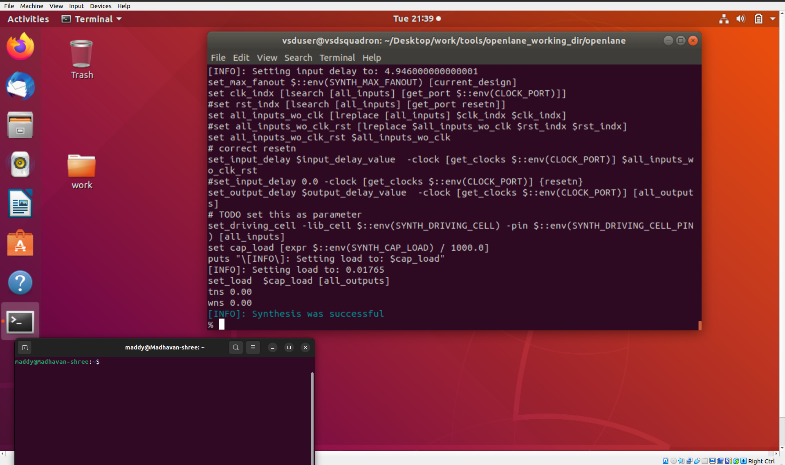</p>

After optimization, **worst negative slack → 0**, indicating timing closure 🕒

---

### 🏗️ Step 8 — Floorplan & Placement Verification

Now that the custom inverter is fully integrated:

```
run_floorplan

```

<p align="center">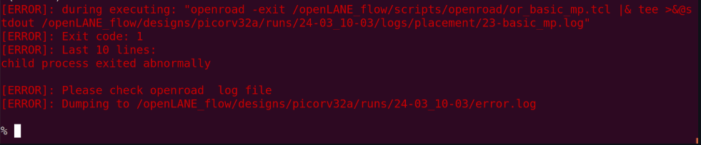</p>

If `run_floorplan` causes issues, use individual commands:

```
init_floorplan
place_io
tap_decap_or
```

<p align="center">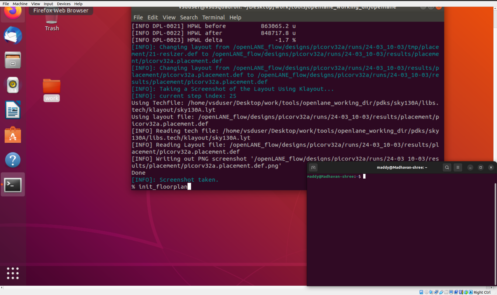</p>

<p align="center">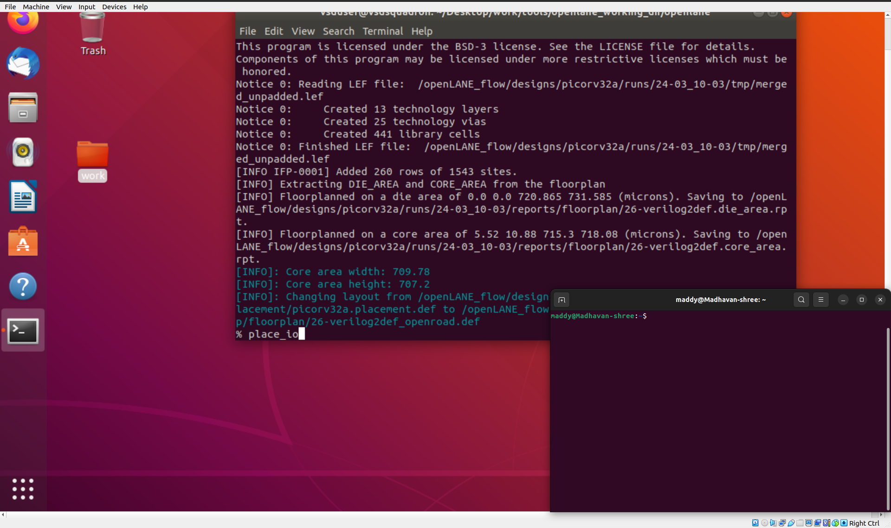</p>

<p align="center">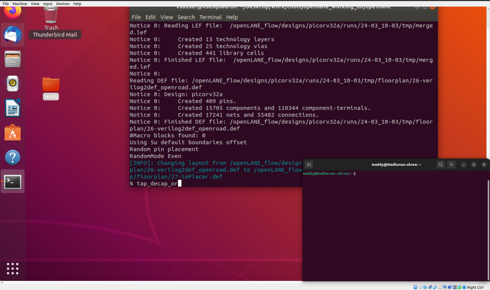</p>

Once done, proceed with:

```
run_placement
```

<p align="center"></p>

<p align="center">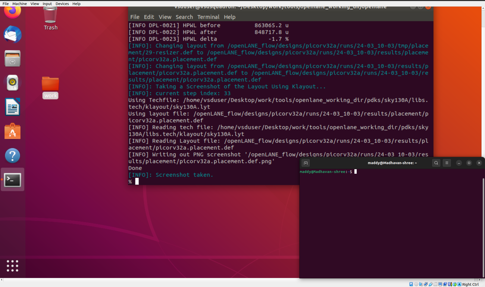</p>

---

Commands to load placement def in magic in another terminal

```
# Change directory to path containing generated placement def
cd Desktop/work/tools/openlane_working_dir/openlane/designs/picorv32a/runs/24-03_10-03/results/placement/

# Command to load the placement def in magic tool
magic -T /home/vsduser/Desktop/work/tools/openlane_working_dir/pdks/sky130A/libs.tech/magic/sky130A.tech lef read ../../tmp/merged.lef def read picorv32a.placement.def &
```

Command for tkcon window to view internal layers of cells

```
# Command to view internal connectivity layers
expand
```

<p align="center">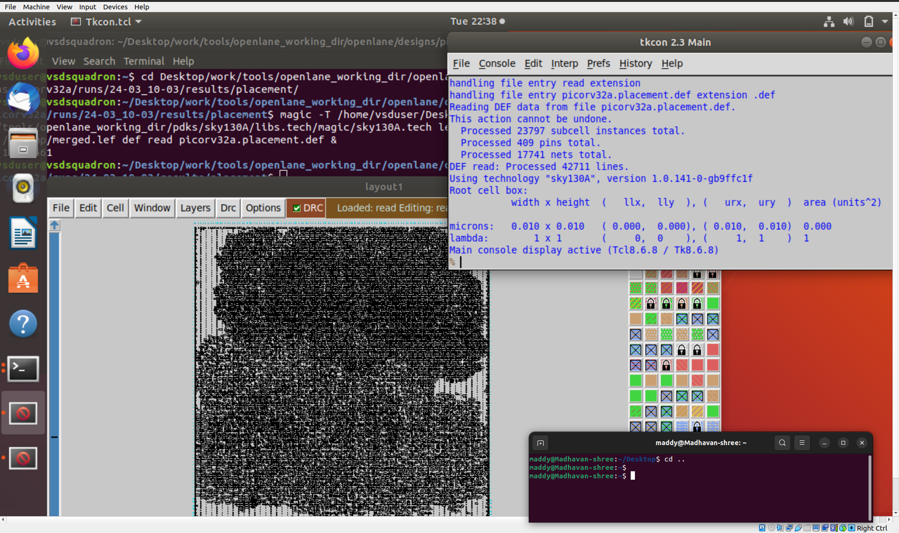</p>

Abutment of power pins with other cell from library clearly visible

### 🕒 Step 9 — Perform Post-Synthesis Timing Analysis

After synthesis, it’s essential to **evaluate the design’s timing performance** using **OpenSTA** to ensure setup and hold constraints are satisfied.

Launch the OpenLANE environment and execute:

```
openroad
read_liberty $::env(LIB_SYNTH)
read_verilog $::env(DESIGN_DIR)/runs/24-03_10-03/results/synthesis/picorv32a.synthesis.v
link_design picorv32a
read_sdc $::env(DESIGN_DIR)/src/my_base.sdc
report_checks -path_delay min_max -fields {slew cap input_pins nets fanout} -digits 4

```

📈 This report provides critical details like:

- **Path delays** across the design
- **Slew rate and capacitance**
- **Hold and setup violations**

---

### 🔧 Step 10 — Timing ECO (Engineering Change Order) Fixes

If timing violations persist, apply **ECO optimization** by tweaking buffer strength or resizing gates.

To generate an ECO netlist:

```
write_verilog $::env(DESIGN_DIR)/runs/24-03_10-03/results/synthesis/picorv32a.synthesis_eco.v

```

Then replace the original synthesized netlist with the ECO version:

```bash
cp runs/24-03_10-03/results/synthesis/picorv32a.synthesis_eco.v runs/24-03_10-03/results/synthesis/picorv32a.synthesis.v

```

Re-run synthesis to validate improvements:

```
run_synthesis

```

✅ Once timing violations are cleared, proceed to physical stages.

---

### 🧩 Step 11 — Floorplan & Placement with Updated Netlist

Initialize the floorplan for physical design using the ECO-updated netlist:

```
init_floorplan
place_io
tap_decap_or
run_placement

```

Once completed successfully, verify placement results through Magic or OpenROAD GUI:

```bash
magic -T sky130A.tech lef read merged.lef def read picorv32a.def &

```

🖥️ The new custom inverter should appear within the design — integrated into the floorplan layout.

---

### 🕹️ Step 12 — Clock Tree Synthesis (CTS)

Now, it’s time to **construct a balanced clock network** ensuring all sequential elements receive synchronized clock edges.

Execute CTS using:

```
run_cts

```

During CTS, buffers such as `sky130_fd_sc_hd__clkbuf_1` and higher drive-strength variants are inserted to minimize skew.

After CTS completion, verify results:

```
report_cts

```

📊 This step evaluates:

- Total number of inserted buffers
- Achieved skew and latency
- Clock net connectivity

---

### ⚡ Step 13 — Post-CTS Timing Verification

With the clock tree built, it’s crucial to confirm that all **setup and hold constraints** remain valid after the additional buffers.

Run timing analysis again:

```
openroad
read_liberty $::env(LIB_SYNTH)
read_verilog $::env(DESIGN_DIR)/runs/24-03_10-03/results/cts/picorv32a.cts.v
link_design picorv32a
read_sdc $::env(DESIGN_DIR)/src/my_base.sdc
report_checks -path_delay min_max -fields {slew cap input_pins nets fanout} -digits 4

```

To evaluate the effect of buffer removal (for example, `sky130_fd_sc_hd__clkbuf_1`), edit:

```
set ::env(CTS_CLK_BUFFER_LIST) "sky130_fd_sc_hd__clkbuf_2 sky130_fd_sc_hd__clkbuf_4"
run_cts

```

Re-run the analysis and verify improved skew performance.

Once no violations remain, the **post-CTS netlist** is finalized for routing. 🚀

---

### 🧾 Step 14 — Quick Recap of Day 4 Workflow

| **Phase** | **Action** | **Tool Used** | **Result** |
| --- | --- | --- | --- |
| DRC Validation | Checked cell grid alignment | Magic | Cell ready for integration |
| LEF Extraction | Generated custom cell LEF | Magic | sky130_vsdinv.lef |
| Config Update | Added LEF & LIB in config.tcl | TCL | Integrated library setup |
| Synthesis | Compiled design with custom inverter | OpenLANE | Clean timing |
| Timing Analysis | Verified pre- and post-CTS performance | OpenSTA | Zero timing violations |
| CTS Execution | Built clock tree network | OpenROAD | Balanced clock distribution |

---

### 🧠 Key Learnings

| **Concept** | **Insight** |
| --- | --- |
| Pre-layout Timing | Early evaluation helps identify timing violations before layout. |
| Custom Cell Integration | Incorporating your inverter into synthesis and placement flow. |
| CTS Optimization | Distributes clock with minimal skew and delay. |
| ECO Fixing | Iterative timing closure through resizing and re-buffering. |

---

### 🏁 Final Outcome

By completing this session, you have:

✅ Integrated a **custom standard cell (inverter)** into a full SoC flow

✅ Performed **synthesis, floorplanning, and CTS**

✅ Conducted **post-layout timing analysis** using OpenSTA

✅ Ensured the design is **timing-clean and physically consistent**

--- 

### 🔗 **Next Step**

➡️ Proceed to **[Day 5 — Final Steps for RTL-to-GDS using TritonRoute and OpenSTA](https://github.com/madhavanshree2006/RISC-V-SoC-Tapeout_Week-6/tree/main/DAY5)**
Explore how the **detailed routing stage** completes physical implementation and how **post-layout timing verification** ensures sign-off quality results using **OpenSTA**.

---
