## 🌟 **Week 6 – Day 5 : Final Steps for RTL → GDSII Flow**

### 🧭 Overview

Welcome to the **grand finale** of Week 6! 🎯

In this session, you’ll wrap up the **entire RTL-to-GDSII design flow** by focusing on the **post-placement and routing phases**, followed by **timing verification** using extracted parasitics.

By the end of today, your SoC design will have completed its **Power Distribution Network (PDN)**, **detailed routing**, and **final OpenSTA timing checks** — bringing your custom design to tape-out readiness! 🚀

---

## 🧩 Step 1 — Power Distribution Network (PDN) Generation

After completing **CTS**, the next step is to build a **robust power grid** to ensure stable VDD and GND delivery across the chip.

### ⚙️ Commands

```bash
# Navigate to the OpenLANE directory
cd Desktop/work/tools/openlane_working_dir/openlane

# Start Docker session (previously aliased)
docker
```

<p align="center">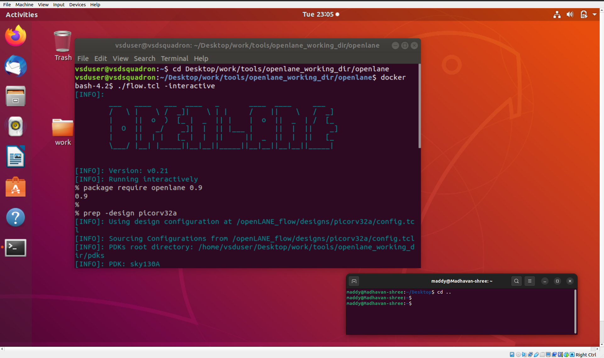</p>

```bash
# Launch OpenLANE in interactive mode
./flow.tcl -interactive
package require openlane 0.9

# Prepare the design
prep -design picorv32a

# Add new LEFs if custom cells were used
set lefs [glob $::env(DESIGN_DIR)/src/*.lef]
add_lefs -src $lefs

# Set synthesis optimization strategies
set ::env(SYNTH_STRATEGY) "DELAY 3"
set ::env(SYNTH_SIZING) 1

# Run synthesis, floorplan, and placement
run_synthesis

```

<p align="center">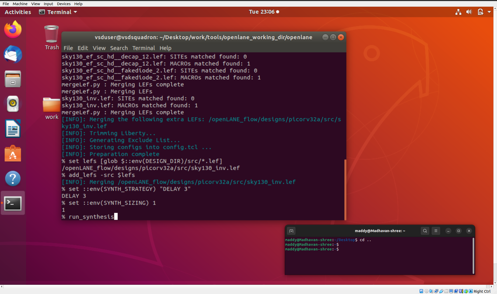</p>

<p align="center">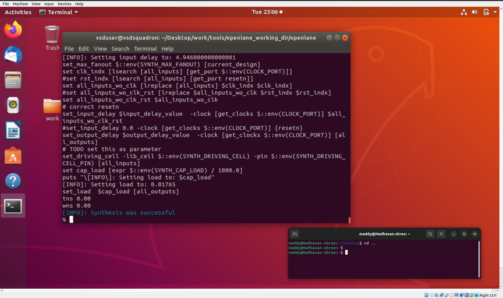</p>

```bash
init_floorplan
place_io
tap_decap_or
run_placement

```

<p align="center">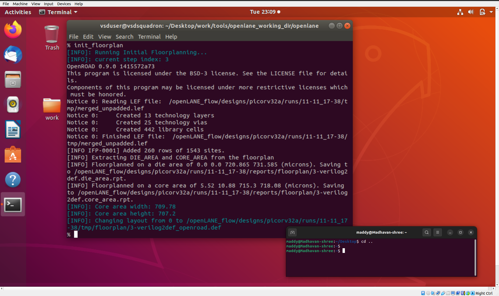</p>

<p align="center">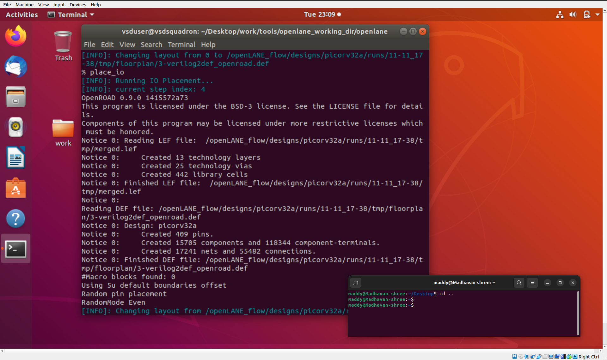</p>

<p align="center">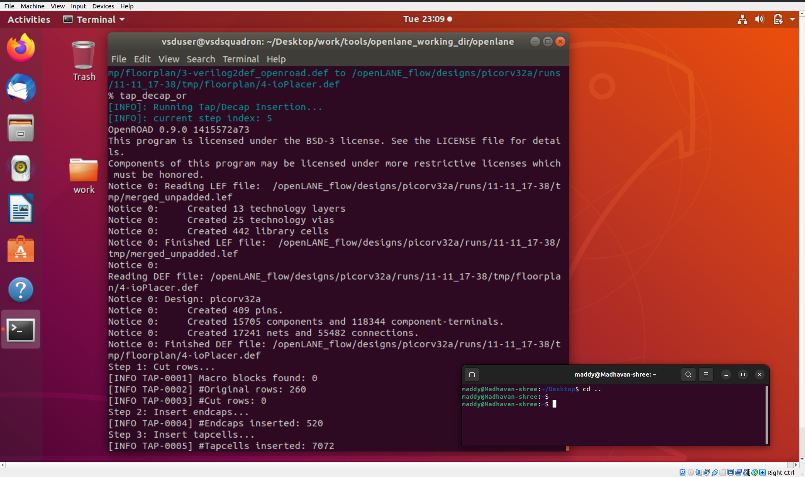</p>

<p align="center">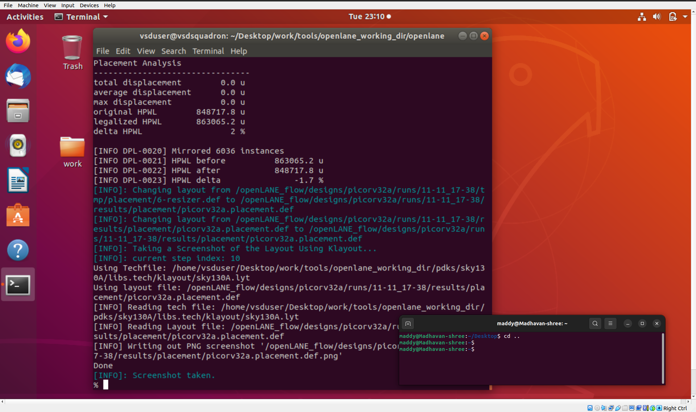</p>

```bash
# Fix library issues if any
unset ::env(LIB_CTS)

# Run CTS
run_cts

# Generate Power Distribution Network
gen_pdn
```

<p align="center">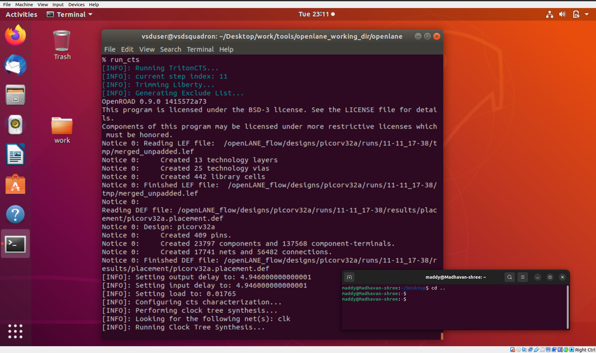</p>
<p align="center">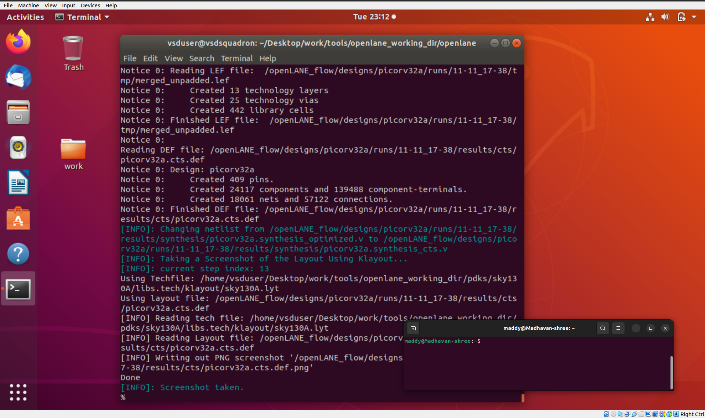</p>

🔋 The **`gen_pdn`** command constructs horizontal and vertical power rails across the layout, connecting macros and standard cells to the power grid.

<p align="center">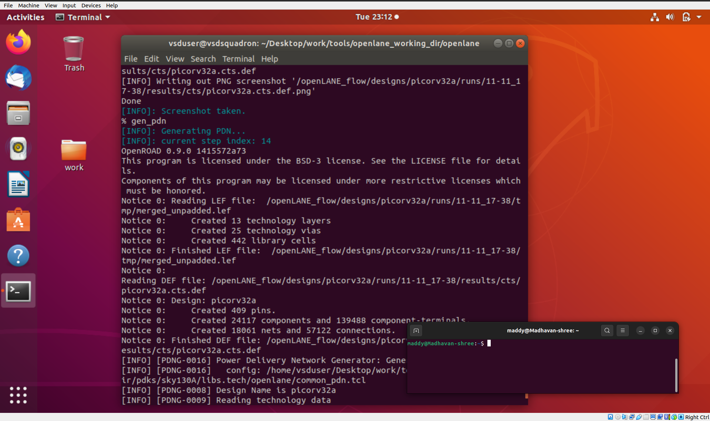</p>

<p align="center"></p>
To visualize it in Magic:

```bash
cd Desktop/work/tools/openlane_working_dir/openlane/designs/picorv32a/runs/26-03_08-45/tmp/floorplan/
magic -T /home/vsduser/Desktop/work/tools/openlane_working_dir/pdks/sky130A/libs.tech/magic/sky130A.tech \
lef read ../../tmp/merged.lef def read 14-pdn.def &

```

<p align="center">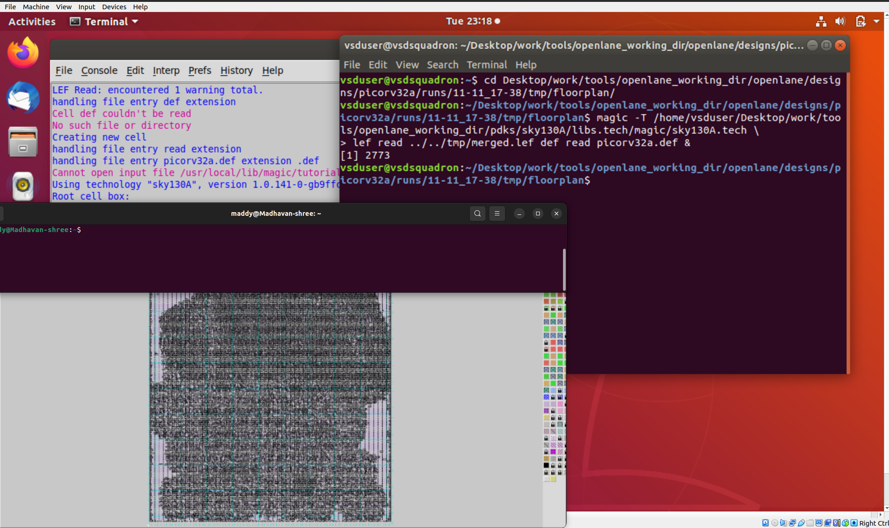</p>

💡 You’ll see thick metal stripes representing **power and ground rails** — this ensures uniform power delivery during operation.

---

## 🧱 Step 2 — Detailed Routing with TritonRoute

Now it’s time to perform **signal routing** — connecting all standard cells, macros, and I/O pins based on the placement layout.

### ⚙️ Commands

```
# Check environment variables
echo $::env(CURRENT_DEF)
echo $::env(ROUTING_STRATEGY)

# Run detailed routing
run_routing

```

🧵 The **TritonRoute** engine performs:

- Track assignment
- Wire segment routing
- Via insertion
- DRC (Design Rule Check) validation

Once complete, open the routed DEF in Magic to inspect the final interconnections:

```bash
cd Desktop/work/tools/openlane_working_dir/openlane/designs/picorv32a/runs/26-03_08-45/results/routing/
magic -T /home/vsduser/Desktop/work/tools/openlane_working_dir/pdks/sky130A/libs.tech/magic/sky130A.tech \
lef read ../../tmp/merged.lef def read picorv32a.def &

```

<p align="center">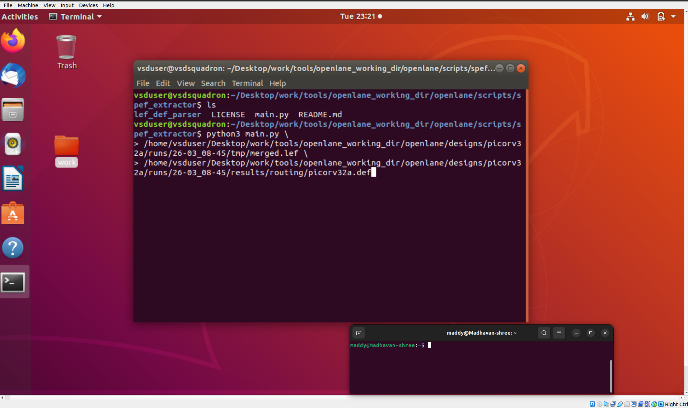</p>

✨ You’ll now see intricate **metal traces** connecting every logic gate and flip-flop — the heart of your chip’s interconnect fabric!

---

## ⚡ Step 3 — Post-Route Parasitic Extraction (SPEF)

After routing, it’s crucial to analyze **parasitic effects** (resistance, capacitance, etc.) that can impact timing.

To extract these parasitics, use the **SPEF extractor tool**:

### ⚙️ Commands

```bash
# Move to SPEF extractor directory
cd Desktop/work/tools/SPEF_EXTRACTOR

# Extract parasitics from routed design
python3 main.py \
/home/vsduser/Desktop/work/tools/openlane_working_dir/openlane/designs/picorv32a/runs/26-03_08-45/tmp/merged.lef \
/home/vsduser/Desktop/work/tools/openlane_working_dir/openlane/designs/picorv32a/runs/26-03_08-45/results/routing/picorv32a.def

```

📘 The generated **SPEF file** contains RC information for every net, which is essential for accurate **timing and power analysis**.

---

## ⏱️ Step 4 — Post-Route Timing Analysis with OpenSTA

Now we’ll use **OpenROAD’s integrated OpenSTA** to perform **timing analysis** on the routed design with parasitics.

### ⚙️ Commands

```
# Launch OpenROAD
openroad

# Read layout and design data
read_lef /openLANE_flow/designs/picorv32a/runs/26-03_08-45/tmp/merged.lef
read_def /openLANE_flow/designs/picorv32a/runs/26-03_08-45/results/routing/picorv32a.def

# Save and reload OpenROAD database
write_db pico_route.db
read_db pico_route.db

# Load synthesized netlist and libraries
read_verilog /openLANE_flow/designs/picorv32a/runs/26-03_08-45/results/synthesis/picorv32a.synthesis_preroute.v
read_liberty $::env(LIB_SYNTH_COMPLETE)

# Link design and constraints
link_design picorv32a
read_sdc /openLANE_flow/designs/picorv32a/src/my_base.sdc
set_propagated_clock [all_clocks]

# Load parasitic data
read_spef /openLANE_flow/designs/picorv32a/runs/26-03_08-45/results/routing/picorv32a.spef

# Generate detailed timing report
report_checks -path_delay min_max -fields {slew trans net cap input_pins} \
-format full_clock_expanded -digits 4

# Exit
exit

```

📊 The timing report will highlight:

- **Critical paths**
- **Slew and capacitance**
- **Setup and hold slack**
- **Delay breakdown per stage**

Once **no violations remain**, your design is officially **timing-clean** and ready for final GDS export! 🏁

---

## 🧠 Key Takeaways

| **Phase** | **Purpose** | **Tool Used** | **Outcome** |
| --- | --- | --- | --- |
| PDN Generation | Builds uniform power grid | OpenLANE + Magic | Stable power rails |
| Routing | Connects all logical nets | TritonRoute | DRC-clean routed layout |
| SPEF Extraction | Captures parasitic RC data | Python SPEF Extractor | Accurate net delay data |
| Post-Route STA | Verifies timing with parasitics | OpenSTA (in OpenROAD) | Timing-clean SoC |

---

## 🏁 Final Outcome

🎯 we have completed the **entire physical design journey** — from **RTL to GDSII**!

By the end of this day, we have achieved:

✅ Generated a **Power Distribution Network**

✅ Completed **detailed routing** with TritonRoute

✅ Extracted **parasitics using SPEF**

✅ Verified **timing closure** post-routing

💫 our SoC design is now **ready for tape-out**, fully verified and layout-complete!

---
