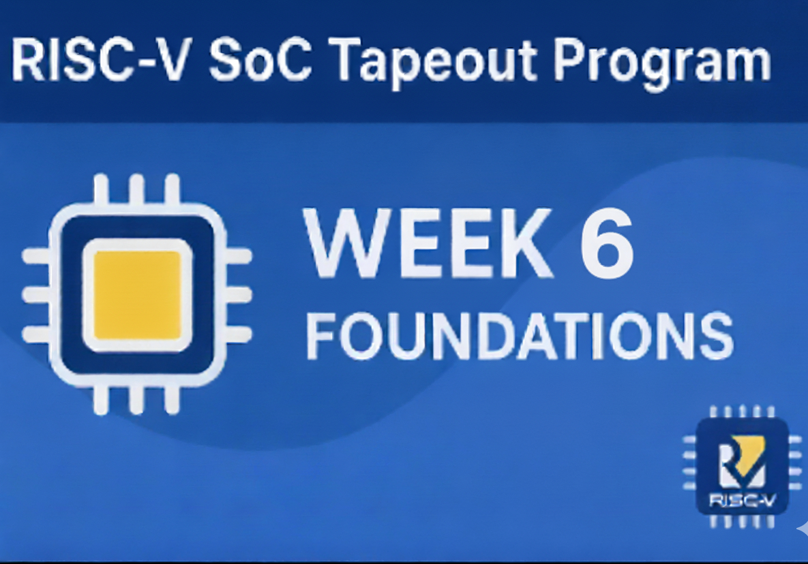

<h1 align="center">🔳 RISC-V SoC Tapeout Program — Week 6️⃣</h1>

---

# ⚙️ Week 6 — Clock Tree Synthesis (CTS) & Routing in OpenROAD

🌟 This is **Week 6** of the **VSD RISC-V SoC Tapeout Program** —

I progressed from **placement (Week 5)** to **Clock Tree Synthesis (CTS)** and **Routing**,

focusing on how clock signals are distributed and how final interconnections are established

for complete physical design closure using **OpenROAD**.

---

## 🚀 Overview

In Week 6, the focus was on the **post-placement backend flow** — performing

**Clock Tree Synthesis**, **Global + Detailed Routing**, and **DRC checks**

to complete the **RTL-to-GDSII** pipeline for an SoC design.

---

## 🎯 Objectives

- Understand the concept of **Clock Tree Synthesis (CTS)**
- Execute **CTS and Routing** using **OpenROAD-flow-scripts**
- Analyze **clock skew, buffer insertion**, and **timing reports**
- Generate **final routed layout and GDSII file**

---

## 📚 Key Learnings — Week 6

### 🧩 Clock Tree Synthesis (CTS)

- Understood **clock network design** and **skew management**
- Analyzed **buffer insertion**, **sink balancing**, and **delay optimization**
- Learned how CTS impacts timing and power

---

### 🧩 Routing & DRC Verification

- Performed **global + detailed routing**
- Verified **wire congestion**, **via insertion**, and **shorts**
- Ensured **zero DRC violations** using automated checks

---

### 🧩 Timing Closure

- Used **OpenSTA** for timing analysis post-routing
- Verified **setup/hold slack**, **path delays**, and **clock distribution**
- Achieved positive timing margins ensuring design stability

---

### 🧩 Flow Automation & Debugging

- Debugged missing DEF/LEF path errors in routing stages
- Re-ran specific flow steps using:
    
    for example: `make cts`, `make route`, `make sta`
    
- Validated output hierarchy and reports

---

### 🛠️ Tools Used

✔ **OpenROAD** — CTS, Routing, Timing Closure

✔ **TritonCTS** — Clock Tree Synthesis

✔ **TritonRoute** — Detailed Routing

✔ **OpenSTA** — Static Timing Analysis

✔ **Magic / KLayout** — GDSII Visualization

✔ **Sky130 PDK** — Process Technology Library

---

> 💡 “Week 6 marked the completion of the full RTL-to-GDSII flow — from synthesis to routed layout —
> 
> 
> mastering clock distribution, routing optimization, and timing verification with open-source tools.” 🚀
> 

---
## 🙏 Special Thanks 👏  
I sincerely thank all the organizations and their key members for making this program possible 💡:  

- 🧑‍🏫 **VLSI System Design (VSD)** – [Kunal Ghosh](https://www.linkedin.com/in/kunal-ghosh-vlsisystemdesign-com-28084836/) for mentorship and vision.  
- 🤝 **Efabless** – [Michael Wishart](https://www.linkedin.com/in/mike-wishart-81480612/) & [Mohamed Kassem](https://www.linkedin.com/in/mkkassem/) for enabling collaborative open-source chip design.  
- 🏭 **[Semiconductor Laboratory (SCL)](https://www.scl.gov.in/)** – for PDK & foundry support.  
- 🎓 **[IIT Gandhinagar (IITGN)](https://www.linkedin.com/school/indian-institute-of-technology-gandhinagar-iitgn-/?originalSubdomain=in)** – for on-site training & project facilitation.  
- 🛠️ **Synopsys** – [Sassine Ghazi](https://www.linkedin.com/in/sassine-ghazi/) for providing industry-grade EDA tools under C2S program.  

--- 
👉 Main Repo Link :  
[https://github.com/madhavanshree2006/RISC-V-SoC-Tapeout-Program](https://github.com/madhavanshree2006/RISC-V-SoC-Tapeout-Program)
